# Object Manager
Object Manager est un client Blazor vous permettant de visualiser vos salles, ainsi que leurs objets en 3D, grâce à la librairie BabylonJS.

## Fonctionnalités
* Gestion CRUD *(bâtiments, salles, types de salles, objets)*
* Création de salle *(base 2D, orientation, hauteur)*
* Editeur de salle en 3D pour gérer les objets
---

## Installation
### Prérequis
Avant de cloner le dépôt, assurez-vous d'avoir :
* .NET 8.0 ou plus récent

### Paramétrage
Une fois le dépôt cloné, vous devez configurer le fichier <code>appsettings.json</code> situé dans le dossier <code>/wwwroot</code> :
* <code>API:Url</code> : L'URL de l'API.
* <code>API:ApiKey</code> : La clé d'API pour avoir les droits de modification. Si l'API n'a pas de clé, laissez à vide.
```json
{
    "API":{
        "Url": "**URL de l'API**",
        "ApiKey": "**Clé d'API si utilisée**",
    }
}
```

## Pages
### Bâtiments et salles
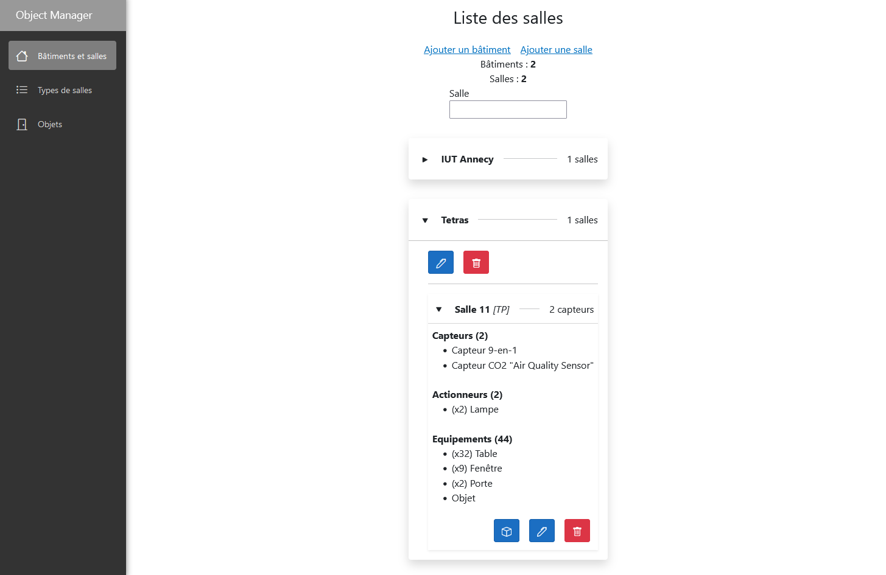  

Vous pouvez voir la liste des salles sur cette page, triées par bâtiment. Vous pouvez depuis cette page :
* **Filtrer** les résultats par **nom de salle complet** *(Nom bâtiment + Nom salle)*
* Aller **créer ou modifier** un bâtiment ou une salle
* Aller **consulter une salle dans l'éditeur 3D**
* **Supprimer** un bâtiment ou une salle

### Création / Modification de salle
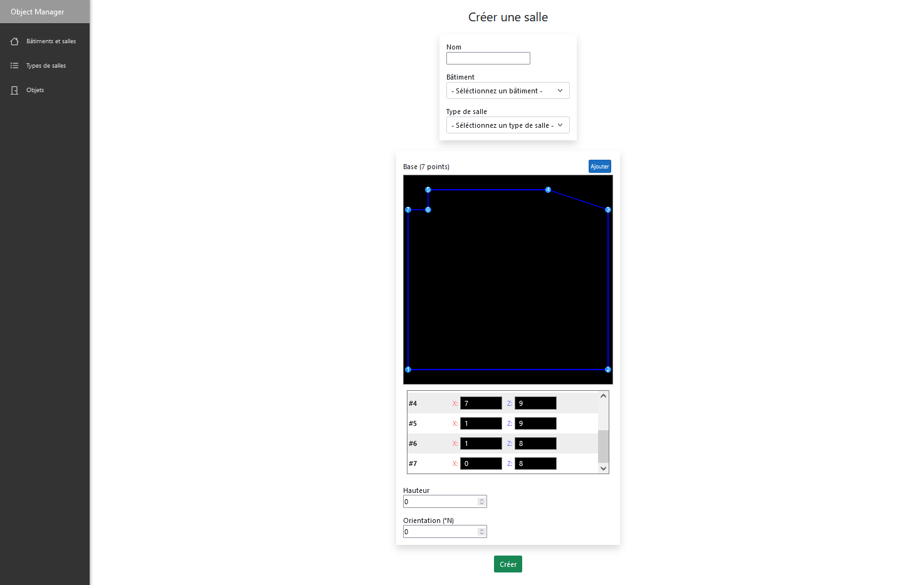  

La page de modification de salle vous permet de configurer plusieurs paramètres :
* Nom
* Bâtiment
* Type de salle
* Base 2D de la salle
* Hauteur
* Orientation *(en °N)*

La salle est représentée par sa **base 2D** (la forme du sol), et sa **hauteur**. Un aperçu de cette base 2D vous permet de visualiser vos modifications. Plusieurs opérations existent pour modifier la base 2D d'une salle :
* Créer et supprimer des points
* **Changer les coordonnées** d'un point (X, Z)
* **Biseauter** un point *(créer un arrondi)*
    * Rayon
    * Résolution *(nombre de points à générer)*
    * Intérieur ou Extérieur


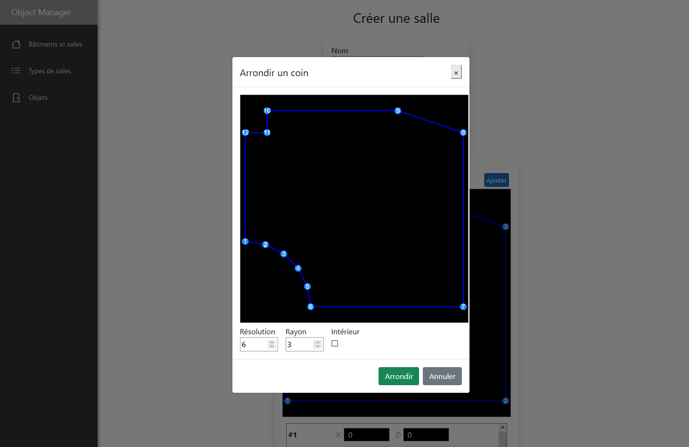  

### Types de salles
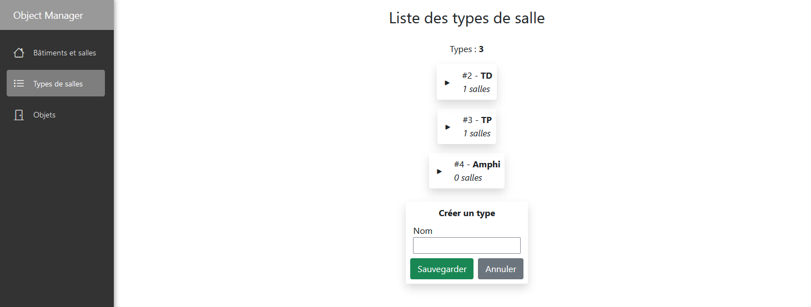  

La liste des types de salles sont affichés sur cette page, ainsi que le nom des salles de chaque type. Vous pouvez ici **créer, modifier et supprimer** des types de salles.

### Objets
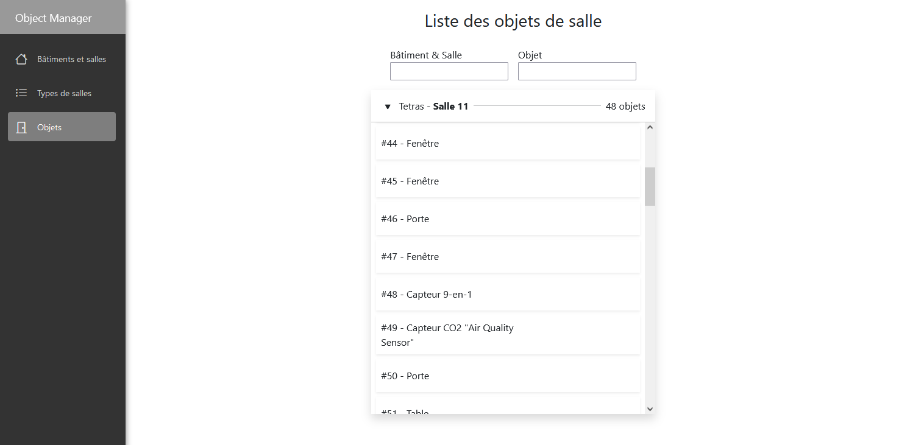  

La liste des objets sont affichés, triés par salle. Sur cette page, vous pouvez :
* **Filtrer** les objets
    * Par **nom de salle complet** *(Nom bâtiment + Nom salle)*
    * Par **nom d'objet complet** *(ID + Type + Nom personnalisé)*
* Aller **consulter l'objet dans sa salle dans l'éditeur 3D**
* **Changer la salle** d'un objet
* **Supprimer** un objet

### Editeur 3D
C'est sur cette page que vous pouvez modifier les objets d'une salle.

---

#### Vue 3D
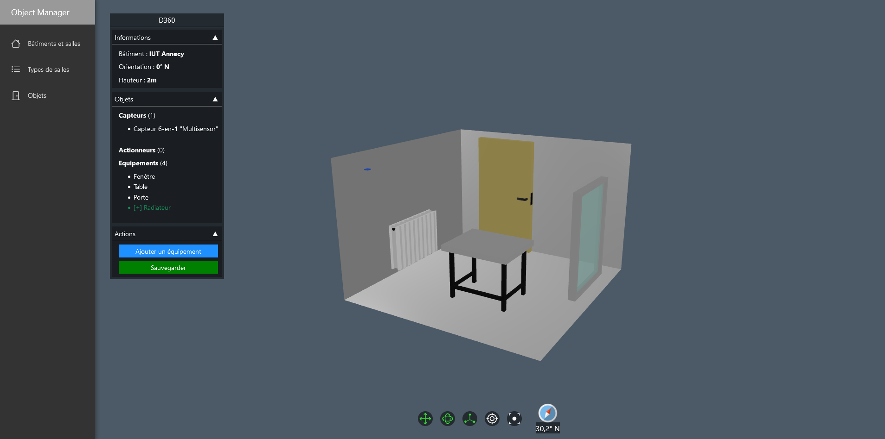  

La salle et ses objets sont affichés en 3D. Voici la **liste des commandes** pour naviguer :
* **Angle de vue** : Glisser la souris en maintenant le clic enfoncé
* **Zoom** : Scroller vers le haut ou le bas
* **Séléctionner un objet** : Clic sur l'objet voulu
* **Barre de contrôles** (ou raccouris clavier) :
    * **Position** (G)
    * **Rotation** (R)
    * **Taille** (S)
    * **Centrer la vue** sur **l'objet sélectionné** (F)
    * **Centrer la vue** sur **la salle** (W)
    * 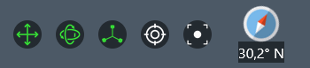

---

#### Fenêtre Salle
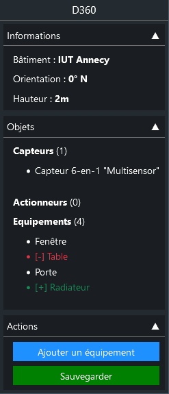  

Sur cette fenêtre dépliante, vous pouvez :
* **Voir les informations** de **la salle**
* **Voir la liste des objets** de **la salle**
    * **Sélectionner** un objet
* **Ajouter** un équipement
* **Sauvegarder** les changements
    * *NOTE: L'application vous demandera une confirmation avant de quitter la page, pour vous éviter de perdre votre progression.*

---

#### Fenêtre Objet sélectionné
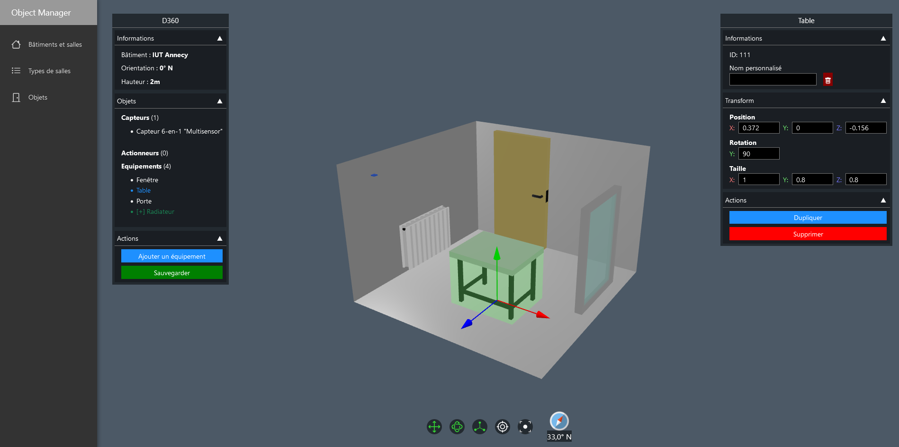  

Cette fenêtre apparaît lorsqu'un objet est sélectionné. Vous pouvez **modifier les propriétés de l'objet** tels que son **nom personnalisé**, ou ses **propriétés spatiales**.  

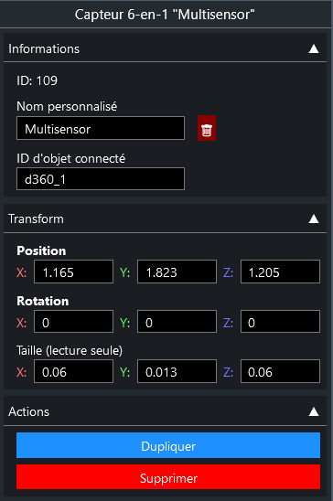  

Il est également possible de **dupliquer l'objet**, ou de le **supprimer**. Si celui-ci existe, il sera **marqué comme supprimé**.

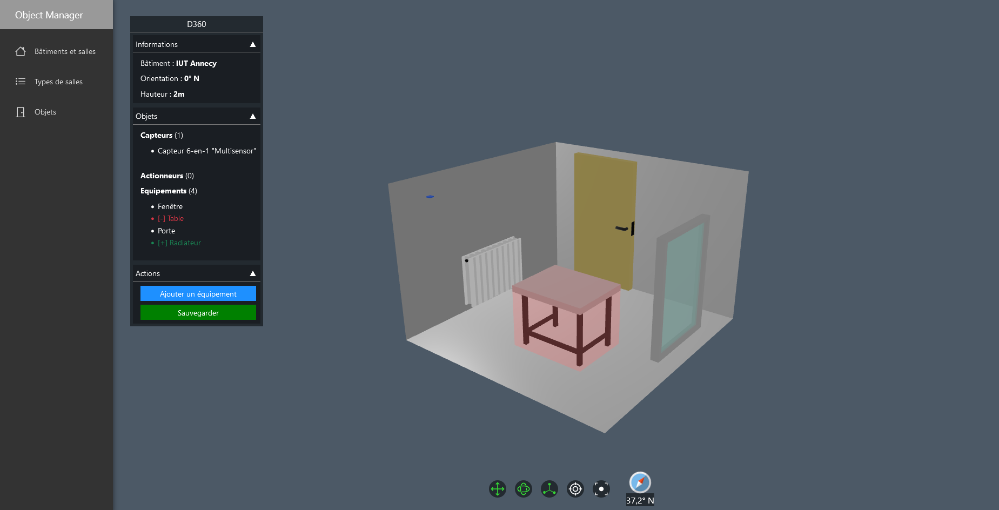  

## Troubleshooting

### Editeur 3D

Certaines limitations de BabylonJS peuvent causer certains problèmes.
* **Impossible d'utiliser les boutons de contrôles** *(ex: position, rotation...)*  
Ce problème survient lorsque l'éditeur 3D est chargé plus d'une fois. Pour régler le problème, **rechargez simplement la page**.

* **Impossible de pivoter un objet**  
Ce problème survient lorsque l'échelle d'un objet a été altérée. C'est une limitation de BabylonJS et il n'y a pas de solution. Il reste possible de pivoter l'objet en utilisant les **zones de saisies**.

## Choix de conception

### Ergonomie
#### Modales
Des modales de confirmation ont été ajoutées afin d'éviter les erreurs de manipulation.

#### Zones de saisies de formules mathématiques
Afin de manipuler les objets 3D avec précision et facilité, un composant Blazor <code>InputMath</code> a été crée. Celui-ci permet de rentrer des formules mathématiques, et celles-ci seront évaluées par la librairie <code>ExpressiveParser</code>.

```php
"0.5+(4.5-0.142)/4" => 1.5895 => 1.590 // Arrondi à 3 décimales
```

### Editeur 3D
L'éditeur 3D réside sur la technologie **JSInterop**, qui permet de communiquer de C# à JavaScript, et vice-versa.

Voici le fonctionnement de la scène et des objets :
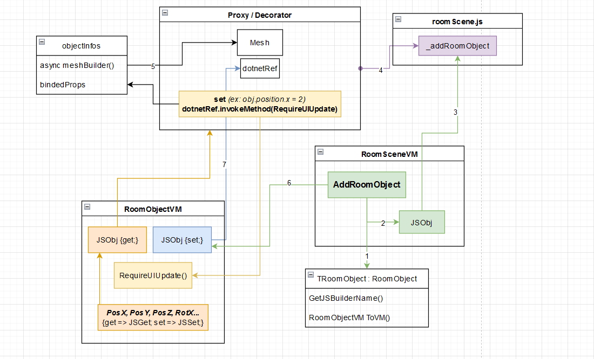  

#### Etapes de création d'un objet
* 1 - Création du ViewModel du RoomObject
* 2 - Appel de la méthode JS en fonction du type
* 3 - Appel de la fonction JS générique de création d'objet
* 4 - Début de création de l'objet JS
* 5 - Création du nouveau Mesh
* *Fin de la création de l'objet JS proxifié et décoré*
* 6 - Assignation du nouvel objet JS au VM
* 7 - Assignation de la DotNetRef du VM à l'objet JS

#### Data-binding cross-langages (C# - JS)
L'objet JS étant proxifié, chaque changement de propriété contenue dans les **bindedProps** de l'objet déclenche une update du VM C#, qui appelle un EventHandler.  

Les propriétés C# du VM récupèrent les données depuis JS, et assignent les valeurs dans l'objet JS *(ce qui déclenchera une update du VM par le proxy)*.

### Parsage JSON des objets de salle

Afin de réduire considérablement le nombre de routes à créer pour l'API, et le nombre de services à créer, tous les objets de salle héritent de la classe abstraite **RoomObject**.

Un convertisseur JSON spécial <code>RoomObjectJSONConverter</code> est crée et est utilisé par le client pour recréer les objets dérivés de RoomObject, à partir d'une propriété ajoutée lors de la sérialisation : <code>RoomObjectType</code>. **Ce convertisseur est utilisé côté client et côté API**.

```json
// api/RoomObjects/GetById/4
{
    "RoomObjectType": "Door",
    "Id": 4,
    "CustomName": "MaPorte",
    "PosX": 1.2,
    "PosY": 0,
    "PosZ": -2,
    "Orientation": 90,
    "SizeX": 1.2,
    "SizeY": 0,
    "SizeZ": -2,
}
// RoomObjectJSONConverter => Door
```

## Fonctionnalités manquantes
Voici la liste des fonctionnalités qui avaient été envisagées **mais qui n'ont pas fini dans le client/API final**.

### Tests du client
Des tests unitaires auraient été bénéfiques pour s'assurer du bon fonctionnement de services, notamment les <code>IService</code> qui permettent de communiquer avec l'API.

Les tests E2E n'étaient pas envisagés, à cause de la complexité d'en créer pour une scène 3D interactive.

### Connexion à InfluxDB et API IA
Cela aurait permis d'intégrer les fonctionnalités sur le client, pour afficher des graphiques, faire des prédictions, en utilisant les <code>ConnectedObject.CustomId</code> pour choisir les capteurs.

### Connexion directe à la RaspberryPI
L'API étant hébergée sur Azure, et la Raspberry sur un réseau privé, il est impossible d'appeler la Raspberry depuis l'API. Cependant, l'inverse reste possible.

L'idée était donc de lancer une requête **WebSocket** depuis la Raspberry, vers l'API Azure, afin de créer un tunnel de connexion direct par lequel l'API pourrait envoyer des requêtes à la Raspberry et vice-versa.

Une fois le lien établi, l'API pourrait appeler la Raspberry lors du déclenchement de certains routes, pour par exemple allumer ou éteindre des actionneurs à distance *(ex: /api/Lamp/activate/d351_lamp1)*.

Un prototype fonctionnel a été réalisé, mais l'implementation finale n'a pas été finalisée et a été retirée.